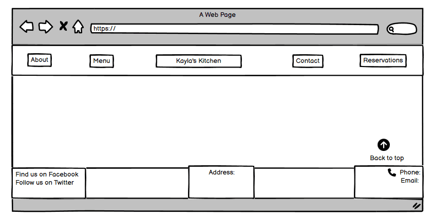

# Kayla’s Kitchen
Kayla’s Kitchen is a family owned Italian restaurant that has been passed down for generations. It is a cozy spot located in Dublin that serves homemade Italian meals. They offer a variety of dishes, from comforting classics to creative new flavors. The atmosphere is warm and inviting, making it the perfect place to enjoy a tasty meals with friends or family.

You can view the live site here - [Kayla's Kitchen](https://tee-24.github.io/Kaylas-Kitchen/index.html)

## Design

### Wireframes
The design and structure for this website was created in Balsamiq wireframes. The designs produced for each page were for mobile and desktop versions only. The final designs and structure differ from the wireframes due to developments during the construction of the website.

**About page**

**Menu page**

**Contact page**

**Reservations page**

