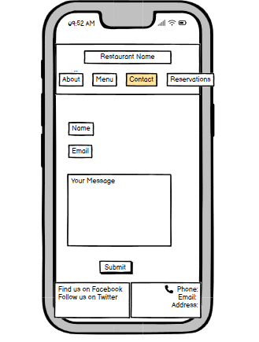

# Kayla’s Kitchen
Kayla’s Kitchen is a family owned Italian restaurant that has been passed down for generations. It is a cozy spot located in Dublin that serves homemade Italian meals. They offer a variety of dishes, from comforting classics to creative new flavors. The atmosphere is warm and inviting, making it the perfect place to enjoy a tasty meals with friends or family.

You can view the live site here - [Kayla's Kitchen](https://tee-24.github.io/Kaylas-Kitchen/index.html)

## User Experience (UX)

### Target Audience
* Users that are looking for an Italian Restaurant in Dublin
* Users who appreciate Italian cuisine and fine dining experiences

### User Stories
* A user should be able to determine the site's purpose immediately
* A user should be able to easily and intuitively navigate the site
* A user should find it easy to contact the restaurant for more information

### Site Aims
* To offer a clear method to contact the business
* To provide information on the restaurant
* To sell the business to the user in a warm, friendly, and inviting manner

## Design

### Wireframes
The design and structure for this website was created in Balsamiq wireframes. The designs produced for each page were for mobile and desktop versions only. The final designs and structure differ from the wireframes due to developments during the construction of the website.

**About page**

**Menu page**

**Contact page**

**Reservations page**

## Features

The website consists of 5 pages, 3 of which are accessible from the navigation menu (About page, Menu page & Contact page). The About page is the default landing page. The logo is centered and is also linked to the About page. Under the logo are three navigation links of About, Menu, and Contact. The fourth page is a thank you page which is shown once a user submits the form on the Contact page. The fifth page is a 404 error page which will open if the user clicks on a broken link.

* All Pages on the website have:

  * Favicon - This will provide an image in the the tab's header to allow the user to easily identify the website if they have multiple tabs open. The fork and knife with plate emoji was chosen as it matched the theme of the website.

  * A responsive header containing the logo which is centered and is linked to the About page.

  * A responsive navigation bar in the header, under the logo, which allows the user to navigate through the site. The color of the text in the navigation bar changes to white when the mouse hovers over it.

  * A responsive footer which is broken down into 3 subsections. The first section contains links to restaurant phone number and email which will open in the phone and mail app respectively. The second section contains the restaurant address. The third section contains social media links to Instagram and Facebook which will open in new tabs. On large screens the subsections are laid out in a columns, however on mobile devices the subsections are stacked vertically.

  

* About Page
  * About Us Section - This section is broken down into 2 subsections and gives users some information on the restaurant. On large screens the subsections are laid out in 2 rows, however on mobile devices the subsections are stacked vertically.

  * Back to top button - This will take the user back to the top of the page without needing to scroll.

* Menu Page
  * Menu navigation - A responsive navigation bar under the header which allows the user to skip to the different sections of the menu. The text in the navigation bar becomes underlined when the mouse hovers over it.

  * A responsive menu which is split into 2 columns on larger screens but stacked vertically on mobile devices.

  * Back to top button - This allows users to return to the navigation menu easily from any point as they scroll down the page.

* Contact Page
  * Form - This contains fields for the users name, email address, and a text area for the user to write their message. The user submits the form using the submit button. Users must fill in the name, email and text area fields to be able to submit the form. If they don't a tooltip will guide them to fill in any information they have missed.

  * Buttons - When the mouse hovers over the submit and reset buttons, the background color of the button changes to black, and the color of the text changes to white.

* Thank You Page
  * A message thanks the user for submitting the form and lets them know someone will be in touch soon.

  * Automatically redirects the user to the About page after 5 seconds.

  * Contains a link to go back the the About page if not automatically redirected.

* 404 Error Page

  * A message tells the user that the requested page cannot be found.

  * Contains a link to go back the the About page without needing to use the back button.

* Future Implementations
  * Reservation page - The user would be able to make a reservation on the website by filling out a form. The form would contain fields for the user's name and email address, and  allow the user to select the number of guests and the date of the reservation.

## Technologies Used

* HTML5 - Delivers the structure and content for the website
* CSS3 - Provides the styling for the website
* Balsamiq - Used to create wireframes for the website
* Git - For version control
* Gitpod - Used to develop the website? (started with CA)
* Visual Studio Code IDE - Used to develop the website
* Gitbash - Terminal used to push changes to the GitHub repository
* GitHub - Used to host and deploy the website
* Google Dev Tools - To troubleshoot and test features, solve issues with responsiveness and styling
* [Font Awesome](https://fontawesome.com/) - Used to make back-to-top button
* [iLoveIMG](https://www.iloveimg.com/) - Used to compress images
* [Google Fonts](https://fonts.google.com/) - Used to import fonts used on the website
* [Favicon Generator](favicon.io) - Used to create the favicon for the website
* [Am I Responsive](http://ami.responsivedesign.is/) - To show the website image on a range of devices

## Deployment & Local Development

### Deployment
The website was deployed to GitHub pages via the following steps:

1. Log in (or sign up) to Github
2. Go to the repository for this project
3. Click settings 
4. Under code and automation, click pages
5. Select main branch
6. Click save

### Local Development

#### How to Fork
To fork the Kayla's Kitchen repository:
1. Log in (or sign up) to Github
2. Go to the repository for this project
3. Click the Fork button in the top right corner

#### How to Clone
To clone the Kayla's Kitchen repository:
1. Log in (or sign up) to Github
2. Go to the repository for this project
3. Click on the code button, select whether you would like to clone with HTTPS, SSH or GitHub CLI
4. Copy the link shown
5. Open the terminal in your code editor and change the current working directory to the location you want to use for the cloned directory
6. Type 'git clone' into the terminal 
7.  Paste the link you copied in step 3
8. Press enter

## Testing 

### Solved Bugs

1. Fixed header would not allow menu navigation to work correctly as the top of the menu would be hidden by the header. After checking the internet and trying multiple solutions to no avail, I reached out to my mentor who suggested I remove the fixed header and use a back to top button instead.

2. The text on top of the image was not clearly visible on mobile devices because of the light in the image. I was able to fix this by repositioning the image and lowering the text on the image.

3. The back to top button appeared too high up on the page because of the large footer. I was able to fix this by positioning the button lower on the page, in the footer.

## Credits

* Fonts were sourced from [Google Fonts](https://fonts.google.com/)
* Favicon was sourced from [Favicon Generator](favicon.io)
* All images were sourced from [Pexels](https://www.pexels.com/)
* Images were compressed by [iLoveIMG](https://www.iloveimg.com/)
* Meta refresh tag was learned from [W3 Schools](https://www.w3schools.com/tags/att_meta_http_equiv.asp)
* 404 error page was learned via Youtube from [Dee Mc](https://www.youtube.com/watch?v=Jj42_s3KnuM)
* README was learned from [Kera Cudmore](https://github.com/kera-cudmore/readme-examples?tab=readme-ov-file)

### Acknowledgements
This site, Kayla's Kitchen, was designed and developed in conjunction with the Full Stack Software Developer Diploma course (ecommerce) at the Code Institute. I would like to thank my mentor, Daisy, the Slack community, and Code Institute for all their support.